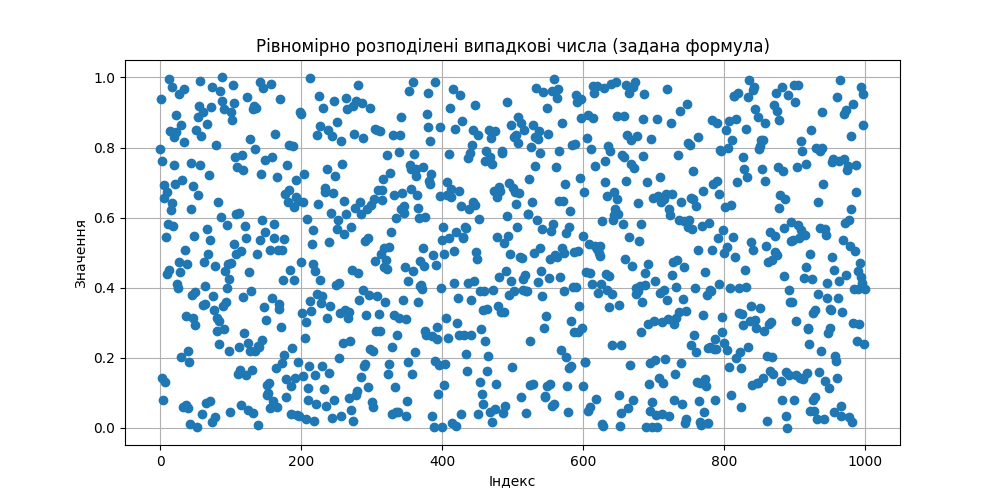
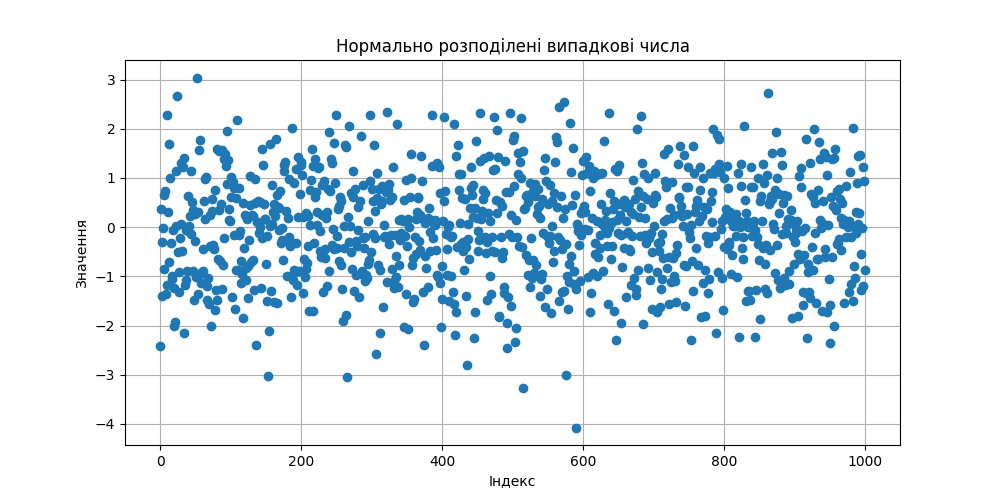
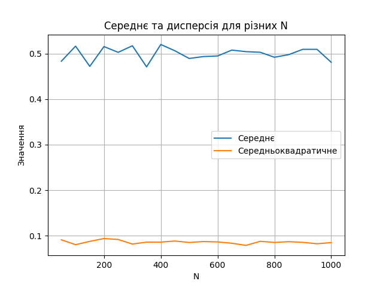
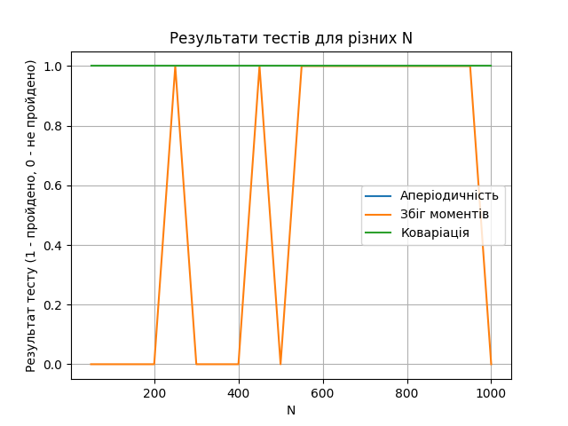
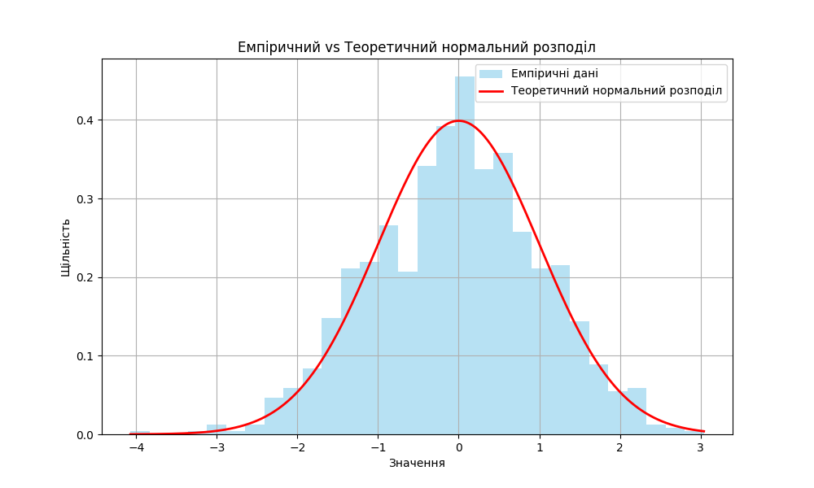

# sre_lab_work
Lab work 1 for SRE

[Path to output data](../../data/lab_1/output)

[Main file](main.py)

Uniform Numbers:

Normal Numbers:

Mean And Variance::

Tests Results:

Empirical vs Theoretical fit:
